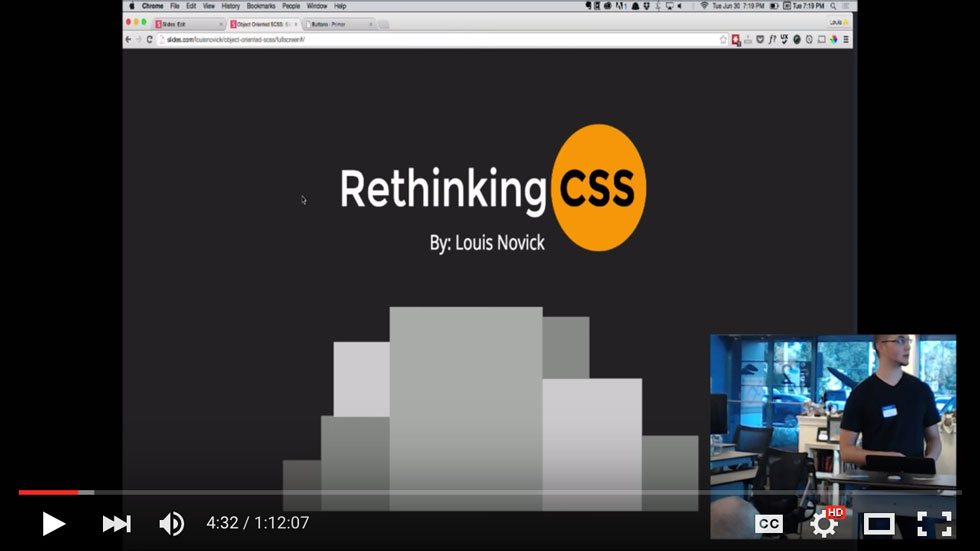
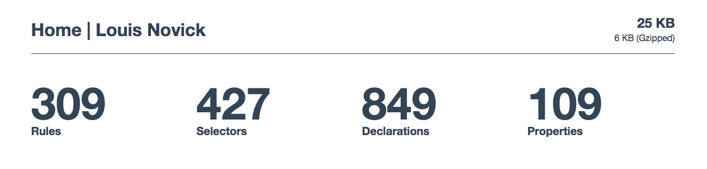
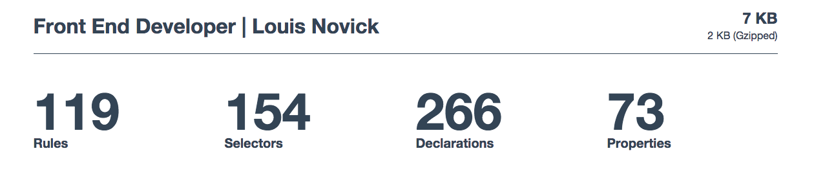
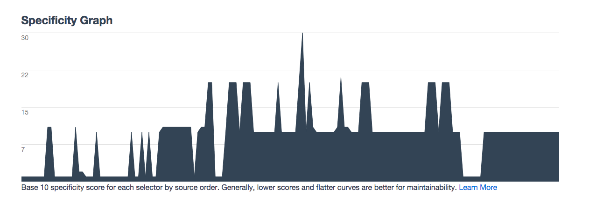
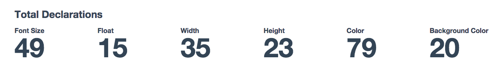
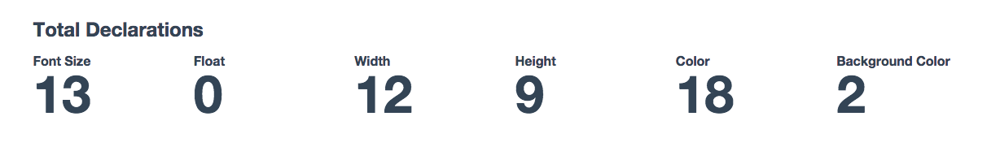
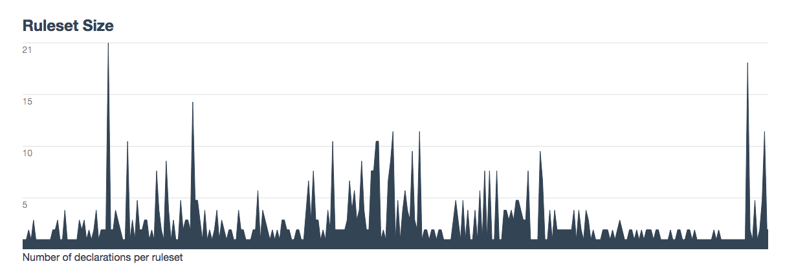
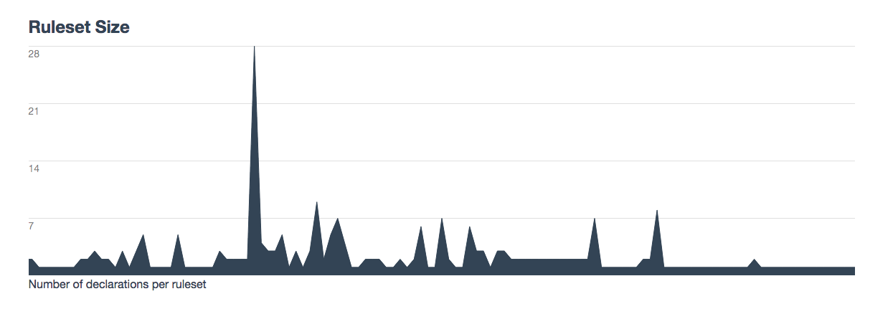

##[University CSS](http://www.meetup.com/University-CSS-Meetup/) - World War CSS

On June 30th of this year I gave a brief talk at [Cloudspace](http://cloudspace.com/) regarding Modular CSS and the importance of rethinking the way we write CSS. My talk was followed by [Sergio Cruz](https://sergiocruz.me/) speaking about Gulp and improving your CSS workflow. I decided that it was about time I posted the link to the video of the meetup here on my site for your viewing pleasure.  Writing Modular CSS is something I have really enjoyed learning more about and I'm willing to bet that if you take the dive you will too.

###[Link to my Slides](http://slides.com/louisnovick/object-oriented-scss/fullscreen#/)

###CSS is easy to write, but difficult to write well

This is something that became very apparent to me after spending over a year writing CSS only to start discovering the flaws with my ways.  My CSS was difficult to reuse and hard to manage whenever I had to return to it after prolonged periods of time.  I began reading a lot about how I could improve, taking inspiration from other great Front End Devs out there like [Drew Barontini](http://drewbarontini.com/) and [John D Jameson](http://johndjameson.com/).  I was slowly introduced to many of the concepts I would start putting into practice later and eventually lead to a library made by these same folks in addition to other great devs.  It was called [MVCSS](http://mvcss.io/) and it fundamentally changed the way I looked at CSS.

As I tried to express my excitement over MVCSS to other developers including those I gathered inspiration from in the first place, I was told to read up on the fundamentals before diving into something this opinionated and complex.  Knowing that I learn best by working backwards, the proverb "sometimes you must run before you can walk", came to mind.  I decided that I would give it a try and redesign my own website using it.  The experience reminded me of why I love web development in the first place, the constant discovery and learning.  A website I had just redesigned months prior had already been scrapped and replaced by something I could be even more proud of.  When I looked at my CSS, I no longer cringed at the scope of my classes or the inevitable maintainability nightmare I knew lurked on the horizon.

I wont go too in depth on exactly how to use MVCSS, or how it worked for me.  However, I will provide some screenshots to better illustrate what rethinking my CSS did for me in a very short amount of time.

##This is a before and after of my websites CSS Stats

###Before

###After

---

###Before

###After

---

###Before

###After

---

###Before

###After

---

Notice the enormous reduction in file size, specificity and declarations.  A flatter curve means more maintainability and fewer headaches, true also for the ruleset size.  By changing the way I wrote and thought about my CSS I was able to improve my code on just about every front.  The result is a maintainable, leaner and overall more efficient code base.  I like to imagine using these same principles at larger scale.  If the improvement is even a slight reflection of the data above, the benefits would be very notable.

_Thanks for reading and catch you next time!_
