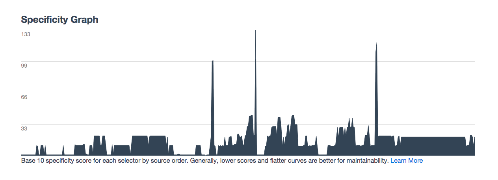

##[University](http://www.meetup.com/University-CSS-Meetup/) CSS - World War CSS

On June 30th of this year I gave a brief talk at [Cloudspace](http://cloudspace.com/) regarding Modular CSS and the importance of rethinking the way we write CSS. My talk was followed by [Sergio Cruz](https://sergiocruz.me/) speaking about Gulp and improving your CSS workflow. I decided that it was about time I posted the link to the video of the meetup here on my site for your viewing pleasure.  Writing Modular CSS is something I have really enjoyed learning more about and I'm willing to bet that if you take the dive you will too.

Writing CSS is easy to write but difficult to write well.  This is something that became very apparent to me after spending over a year writing Vanilla CSS only to start discovering the flaws with my ways.  My CSS was difficult to reuse at all and hard to manage whenever I had to return to it, even after a short amount of time.  I began reading a lot about how I could improve, taking inspiration from other great Front End Devs out there like [Drew Barontini](http://drewbarontini.com/) and [John D Jameson](http://johndjameson.com/).  I was introduced to a libary made by these same folks in addition to other great devs.  It was called [MVCSS](http://mvcss.io/) and it changed the way I look at CSS forever.

As I tried to express my excitement over MVCSS to other developers including those I gathered inspiration from in the first place, I was told to read up on the fundamentals before diving into something this opinonated and complex.  Knowing that I learn best by working backwords, the proverb "sometimes you must run before you can walk", came to mind.  I devided that I would give it a try and redesign my own website using it.  The experience reminded me of why I love web development in the first place, the constant discovery and learning.  A website I had just redesigned months prior had already been scrapped and replaced by something I could be proud of.  When I looked at my CSS, I no longer cringed at the scope of my classes or the unevitable unmaintainabilty I knew lurked on the horizon.  I wont go to in depth on exactly how to use MVCSS or how it worked for me because to do so would require another post, perhaps in the near future.  However, I will provide some screenshots to better illustrate what rethinking my CSS did for me in a very short amount of time.

###Here are my CSS stats before

