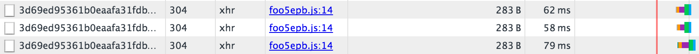
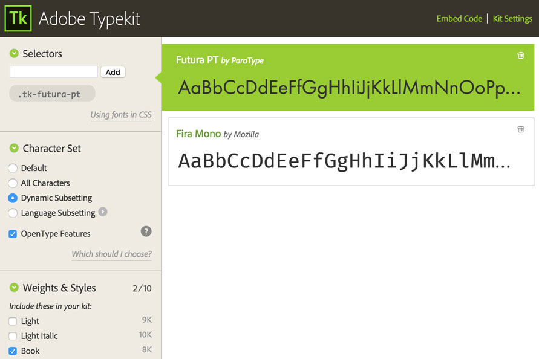

##Learning about Adobe [Typekit](https://typekit.com/fonts)

It was during an episode of the Shop Talk Show, a podcast hosted by Dave Rupert and Chris Coyier, that I first heard about dynamic subsetting in Typekit.  They were interviewing Tim Brown on this particular episode, the Type Manager for Adobe Typekit and he of course had a lot of interesting things to say about web typography.  Anyways, at one point in the show he discussed how Typekit users can take advantage of some of Typekit's more obscure features.  He revealed that by adding a font of another language to your kits you could enable dynamic subsetting which would significantly reduce your font load times.  Once the show was over I had to give it a shot and boy was I happy with the result.

So what is Dynamic subsetting? Invented by Steve Lee, it essentially scans through your web page to decide which characters are actually in use. It then proceeds to construct a subsetted version of your font; hence the term. Finally, it stores this version in your browser cache.

Below are the http requests recorded in my Chrome dev tools for the fonts I’m using on this site, Futura PT and Fira Mono.  As you can see they weigh virtually nothing, a thing of beauty.

Here is a snap shot of my Typekit settings panel for this particular kit.

###Adding A Foreign Language Font

Notice that the Dynamic Subsetting radio button on the left is selected.  If you have used Typekit before you are probably wondering, “Where is this located, I don’t see it, quit lying to me Louis!”  It's there I say! You need only add a font to your kit containing the character set of another language.  That’s right, add a font of a language other than English to your kit and you will be asked to convert your kit to a dynamic one.  Once you have done this, the options will become available to you.  This can feel like kind of a hack since you probably wont always need the font you add to the kit, but I believe you can remove it once published.

I imagine that these "dynamic" settings are especially helpful to those who actually need to use the enormous character sets offered by fonts of other languages.  For example, Source Han Sans offers full support for Japanese, Korean, Traditional Chinese, and Simplified Chinese, all in one convenient package. It also includes Latin, Greek, and Cyrillic glyphs from the popular Source Sans family. Unsurprisingly, the font contains 65,535 glyphs which is also the maximum amount supported in the OpenType format. The complete family is just under half a million total glyphs.  The sheer size of foreign language fonts like this one is breath taking.  Thankfully, Typekit defaults your kit to use dynamic subsetting when using these fonts and for good reason.

There are many ways for us today to get fonts of all shapes and sizes on our websites and apps.   Off the top of my head, Google fonts has an excellent selection and adding fonts through @font-face rules is still an excellent choice.  However, in the case of my own site I chose to give typekit a shot and am extremely pleased with the result.

_Thanks for reading and catch you next time!_

